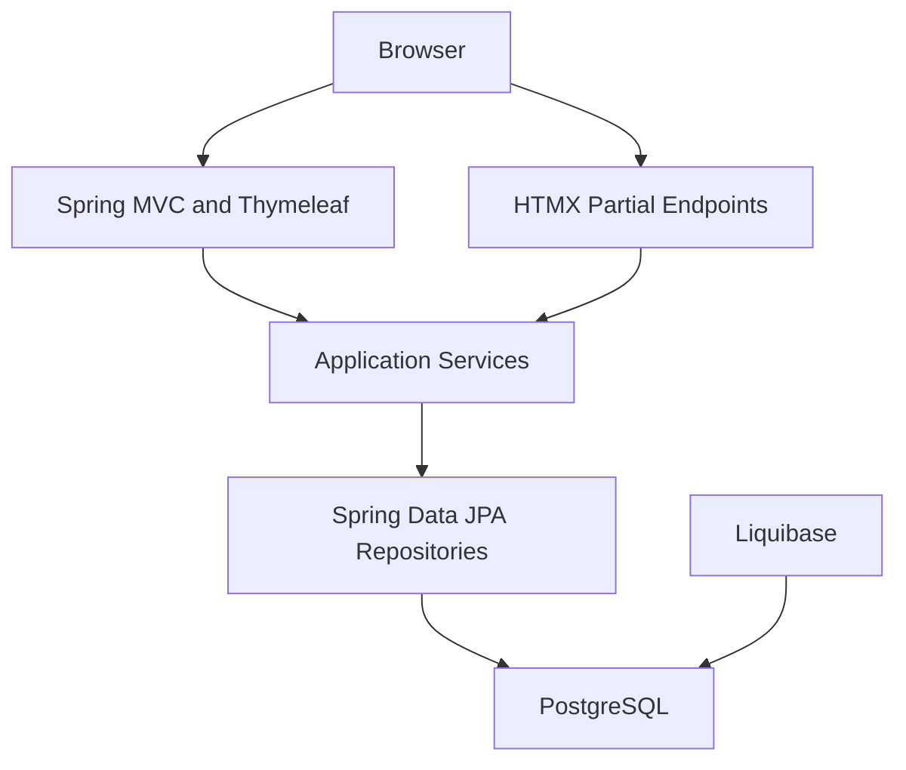
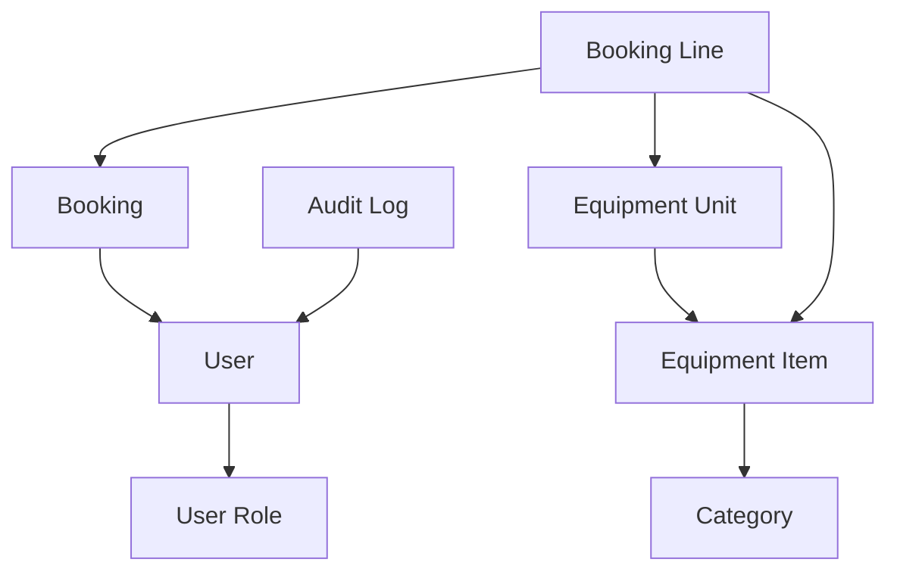

# Техническая спецификация: система складского учета оборудования

## 1. Назначение системы

Система предназначена для учета звукового и светового оборудования, просмотра доступных остатков и бронирования оборудования пользователями на выбранные даты.

Первая версия фокусируется на оборудовании как складском ресурсе: администратор ведет каталог и наличие, пользователь видит доступность и создает бронь без отдельного процесса согласования.

## 2. Границы MVP

### Входит в MVP

- Аутентификация пользователей.
- Ролевая модель: администратор и пользователь.
- Каталог оборудования с категориями, описанием, количеством и признаками учета.
- Поддержка двух вариантов учета:
  - количественный учет позиции, например `10 x Moving Head Beam`;
  - индивидуальный учет экземпляров с инвентарными номерами.
- Мгновенное бронирование доступного оборудования на период дат.
- Проверка доступности при создании и изменении бронирования.
- Календарь занятости и свободных остатков.
- Табличный просмотр оборудования, остатков и бронирований.
- Административное управление каталогом, экземплярами, пользователями и правами на добавление оборудования.
- Docker-образ приложения с подключением к PostgreSQL.
- Миграции схемы БД через Liquibase.

### Не входит в MVP

- Согласование бронирований администратором.
- Учет выдачи/возврата с актами, подписями и материальной ответственностью.
- Складские перемещения между площадками.
- Финансовый учет, аренда, счета и платежи.
- Интеграция с внешними календарями.
- Мобильное приложение.
- Отдельный SPA-фронтенд.

## 3. Роли и права доступа

### Администратор

Администратор управляет справочниками и складским состоянием:

- создает, редактирует и архивирует категории оборудования;
- создает и редактирует позиции оборудования;
- задает общее количество для позиций с количественным учетом;
- создает и редактирует отдельные инвентарные единицы;
- меняет состояние оборудования;
- выдает пользователям право на добавление новых позиций на склад;
- видит все бронирования пользователей;
- создает, редактирует и отменяет бронирования от имени пользователей;
- управляет пользователями и ролями;
- просматривает аудит значимых операций.

### Пользователь

Пользователь работает с доступностью и собственными бронированиями:

- просматривает каталог оборудования;
- видит календарь занятости и свободные остатки;
- создает бронирование на доступный период;
- добавляет новые позиции оборудования, если администратор выдал соответствующее право;
- изменяет или отменяет собственные будущие бронирования, если это разрешено правилами системы;
- просматривает историю своих бронирований.

### Дополнительные права

Помимо базовых ролей нужна назначаемая capability-модель. Минимальное право для MVP:

- `EQUIPMENT_CREATE`: позволяет пользователю создавать новые позиции оборудования и первично заводить складскую карточку.

Право назначается и отзывается администратором. Создание новых позиций доступно роли `ADMIN` и пользователям с правом `EQUIPMENT_CREATE`. Остальные административные операции, включая управление пользователями и массовое изменение складских остатков, остаются за `ADMIN`, если отдельно не расширены будущими permissions.

## 4. Основные пользовательские сценарии

### Добавление оборудования администратором

1. Администратор открывает раздел оборудования.
2. Создает категорию, если подходящей категории еще нет.
3. Создает позицию оборудования: название, модель, тип учета, общее количество, описание.
4. Для индивидуального учета добавляет экземпляры с инвентарными номерами.
5. Система делает позицию доступной для просмотра и бронирования.

### Бронирование пользователем

1. Пользователь открывает каталог, календарь или табличный список.
2. Выбирает оборудование, период дат и количество или конкретные экземпляры.
3. Система в транзакции проверяет доступность на весь период.
4. Если оборудование доступно, создается бронь со статусом `BOOKED`.
5. Если доступного количества недостаточно, пользователь получает сообщение с доступным остатком.

### Просмотр календаря

1. Пользователь выбирает период календаря: неделя, месяц или произвольный диапазон.
2. Система показывает занятость по позициям и остаток свободного количества.
3. Для индивидуального учета можно раскрыть позицию до конкретных экземпляров.

### Табличный просмотр

1. Пользователь или администратор открывает таблицу оборудования.
2. Таблица показывает категорию, название, модель, тип учета, общее количество, забронировано, свободно.
3. Фильтры позволяют искать по категории, названию, периоду доступности и состоянию.

## 5. Бизнес-правила

### Периоды бронирования

- Бронирование задается датой и временем начала `starts_at` и окончания `ends_at`.
- `starts_at` должен быть строго раньше `ends_at`.
- Для дневного режима UI может принимать даты без времени, но backend хранит нормализованный временной интервал.
- Пересечение интервалов определяется правилом:

```text
existing.starts_at < requested.ends_at
AND existing.ends_at > requested.starts_at
```

### Доступность количественной позиции

Позиция доступна, если:

```text
requested_quantity <= equipment_items.total_quantity - sum(active_booking_lines.quantity for overlapping bookings)
```

Активными считаются бронирования в статусах, блокирующих доступность: `BOOKED` и при дальнейшем развитии `ISSUED`.

### Доступность инвентарной единицы

Инвентарная единица доступна, если:

- она находится в состоянии `AVAILABLE`;
- она не архивирована;
- нет активного бронирования этой единицы с пересекающимся периодом.

### Мгновенное бронирование

- Пользователь не создает заявку на согласование, а сразу получает бронь.
- Система обязана повторно проверять доступность на backend при отправке формы.
- UI-проверка доступности считается вспомогательной и не заменяет серверную проверку.

### Отмена и изменение бронирования

- Пользователь может отменить собственное будущее бронирование.
- Изменение периода или состава брони выполняется как новая проверка доступности в транзакции.
- Отмененные бронирования не блокируют доступность.
- Администратор может отменить любое бронирование с обязательным комментарием причины.

### Удаление оборудования

- Удаление позиций оборудования и инвентарных единиц всегда выполняется как soft delete.
- Физическое удаление строк из БД запрещено для пользовательских операций.
- При soft delete сохраняются дата, инициатор и причина: `deleted_at`, `deleted_by`, `delete_reason`.
- Soft-deleted оборудование не показывается в обычном каталоге и не доступно для новых бронирований.
- Исторические бронирования должны продолжать ссылаться на удаленную позицию или инвентарную единицу.
- Операция soft delete записывается в аудит.

## 6. Рекомендуемый технологический стек

### Backend

- Java 21 LTS как базовый промышленный вариант.
- Java 25 LTS можно рассмотреть после подтверждения поддержки инфраструктурой и Docker base image.
- Spring Boot 4.1.x как актуальная стабильная линия на июнь 2026.
- Spring Framework 7.x, поставляемый через Spring Boot 4.1.x.
- Spring Security как обязательный модуль аутентификации, авторизации, CSRF-защиты и проверки ролей/permissions.
- Spring Data JPA.
- Hibernate ORM как JPA-провайдер.
- Bean Validation.
- Liquibase.
- PostgreSQL JDBC driver.
- Testcontainers для интеграционных тестов с PostgreSQL.

### Frontend

Рекомендуемый подход для MVP: серверный UI на Java без отдельного SPA.

- Spring MVC controllers.
- Thymeleaf templates.
- HTMX для частичных обновлений календаря, таблиц и форм без полноценного SPA.
- Alpine.js опционально для небольшого локального поведения форм.
- Bootstrap, Tailwind CSS или другой CSS-фреймворк по выбору команды.

Такой подход оставляет основную бизнес-логику на backend, упрощает развертывание одним Docker-образом и не требует отдельной сборки frontend-приложения.

### Database and Migrations

- PostgreSQL 16+.
- Liquibase changelog в YAML или XML.
- Все изменения схемы БД проходят только через Liquibase.

## 7. Архитектура приложения

Приложение разворачивается как один Spring Boot сервис, который обслуживает HTML-интерфейс и внутренние JSON endpoints для частичных обновлений UI.



### Backend-модули

- `auth`: пользователи, роли, permissions, вход/выход, текущий пользователь.
- `permission`: назначаемые права пользователей, включая `EQUIPMENT_CREATE`.
- `inventory`: категории, позиции оборудования, инвентарные единицы, состояния.
- `booking`: бронирования, строки бронирования, проверка доступности, отмена.
- `calendar`: агрегированные данные занятости и свободных остатков.
- `admin`: административные страницы и операции.
- `audit`: запись значимых изменений.

## 8. Доменная модель



### User

Пользователь системы.

Основные поля:

- `id`;
- `email`;
- `password_hash`;
- `display_name`;
- `enabled`;
- `created_at`;
- `updated_at`.

### Role

Роль доступа.

Базовые роли:

- `ADMIN`;
- `USER`.

### Permission

Назначаемое право пользователя. Для MVP обязательно право `EQUIPMENT_CREATE`.

Основные поля:

- `id`;
- `code`;
- `name`;
- `description`.

### EquipmentCategory

Категория оборудования, например `Звук`, `Свет`, `Кабели`, `Стойки`.

Основные поля:

- `id`;
- `name`;
- `description`;
- `archived`.

### EquipmentItem

Позиция каталога оборудования.

Основные поля:

- `id`;
- `category_id`;
- `name`;
- `manufacturer`;
- `model`;
- `description`;
- `tracking_mode`;
- `total_quantity`;
- `active`;
- `deleted_at`;
- `deleted_by`;
- `delete_reason`;
- `created_at`;
- `updated_at`.

`tracking_mode`:

- `QUANTITY`: бронируется количество без выбора конкретной единицы;
- `UNIT`: бронируются конкретные инвентарные единицы;
- `MIXED`: позиция может иметь и количественный запас, и отдельные инвентарные единицы, если такая гибкость понадобится в первой реализации.

Для упрощения MVP рекомендуется хранить `QUANTITY` и `UNIT`, а `MIXED` добавить только если есть реальные позиции, которым одновременно нужен оба режима.

### EquipmentUnit

Конкретный экземпляр оборудования.

Основные поля:

- `id`;
- `equipment_item_id`;
- `inventory_number`;
- `serial_number`;
- `condition`;
- `status`;
- `notes`;
- `archived`.
- `deleted_at`;
- `deleted_by`;
- `delete_reason`.

`status`:

- `AVAILABLE`;
- `MAINTENANCE`;
- `LOST`;
- `RETIRED`.

### Booking

Бронирование оборудования пользователем.

Основные поля:

- `id`;
- `user_id`;
- `starts_at`;
- `ends_at`;
- `status`;
- `comment`;
- `created_at`;
- `updated_at`;
- `cancelled_at`;
- `cancelled_by`;
- `cancel_reason`.

`status` для MVP:

- `BOOKED`;
- `CANCELLED`.

### BookingLine

Строка бронирования.

Основные поля:

- `id`;
- `booking_id`;
- `equipment_item_id`;
- `equipment_unit_id`;
- `quantity`.

Правила:

- для количественного учета заполнены `equipment_item_id` и `quantity`, а `equipment_unit_id` пустой;
- для индивидуального учета заполнены `equipment_item_id`, `equipment_unit_id`, `quantity = 1`;
- строка не должна одновременно бронировать конкретную единицу и количество больше 1.

## 9. UI-модули

### Вход и профиль

- Страница входа.
- Выход из системы.
- Отображение текущего пользователя и роли.
- Административное управление пользователями.

### Каталог оборудования

- Список категорий.
- Список позиций оборудования.
- Карточка позиции с описанием, общим количеством, свободным количеством и единицами.
- Фильтры по категории, названию, модели, состоянию и доступности на период.

### Таблица оборудования

Колонки:

- категория;
- название;
- производитель;
- модель;
- тип учета;
- всего;
- забронировано на выбранный период;
- свободно на выбранный период;
- состояние;
- действия.

Для администратора доступны действия создания, редактирования, архивации и управления экземплярами.

### Таблица бронирований

Колонки:

- номер бронирования;
- пользователь;
- период;
- статус;
- состав оборудования;
- создано;
- действия.

Пользователь видит свои бронирования, администратор видит все.

### Календарь

Режимы:

- месяц;
- неделя;
- список по дням.

Календарь должен показывать:

- занятые интервалы;
- свободный остаток по позиции;
- индикатор дефицита, если выбранное количество недоступно;
- быстрый переход к созданию бронирования.

Для реализации без SPA:

- основная страница календаря рендерится Thymeleaf;
- переключение периода и фильтров выполняется HTMX-запросами;
- backend возвращает HTML-фрагменты календарной сетки или строк таблицы.

## 10. Контроллеры и маршруты

Спецификация не требует полного OpenAPI для MVP, но основные маршруты должны быть стабильными.

### HTML routes

- `GET /login` - форма входа.
- `POST /login` - обработка входа через Spring Security.
- `POST /logout` - выход.
- `GET /equipment` - таблица оборудования.
- `GET /equipment/{id}` - карточка позиции.
- `GET /calendar` - календарь доступности.
- `GET /bookings` - список бронирований текущего пользователя или всех бронирований для администратора.
- `GET /bookings/new` - форма создания бронирования.
- `POST /bookings` - создание бронирования.
- `GET /equipment/new` - форма создания позиции для `ADMIN` или пользователя с `EQUIPMENT_CREATE`.
- `POST /equipment` - создание позиции для `ADMIN` или пользователя с `EQUIPMENT_CREATE`.
- `GET /admin/equipment/new` - административная форма создания позиции.
- `POST /admin/equipment` - административное создание позиции.
- `GET /admin/equipment/{id}/edit` - форма редактирования позиции.
- `POST /admin/equipment/{id}` - сохранение позиции.
- `POST /admin/equipment/{id}/delete` - soft delete позиции с причиной.
- `GET /admin/users` - управление пользователями.
- `POST /admin/users/{id}/permissions` - выдача или отзыв назначаемых прав.

### HTMX partial routes

- `GET /partials/equipment-table` - обновление таблицы оборудования с фильтрами.
- `GET /partials/calendar` - обновление календарной сетки.
- `GET /partials/availability` - проверка доступности для формы бронирования.
- `GET /partials/equipment/{id}/units` - список единиц позиции.

### JSON API для внутреннего использования

Если появится необходимость в JSON для календаря или интеграций, можно добавить:

- `GET /api/equipment`;
- `GET /api/equipment/{id}/availability?from=&to=`;
- `GET /api/calendar?from=&to=&categoryId=`;
- `POST /api/bookings`;
- `POST /api/bookings/{id}/cancel`.

В MVP предпочтительно не дублировать бизнес-логику между HTML и API: маршруты должны вызывать одни и те же application services.

## 11. Сервисы приложения

### InventoryService

Отвечает за:

- создание и обновление категорий;
- создание и обновление позиций;
- управление общим количеством;
- управление инвентарными единицами;
- архивирование оборудования.

### AvailabilityService

Отвечает за:

- расчет свободного количества на период;
- поиск конфликтующих бронирований;
- подготовку данных для календаря;
- проверку доступности перед созданием бронирования.

### BookingService

Отвечает за:

- создание бронирования;
- изменение бронирования;
- отмену бронирования;
- применение транзакционных блокировок;
- запись аудита.

### CalendarService

Отвечает за:

- агрегацию занятости по дням или временным интервалам;
- формирование DTO для календарной сетки;
- подготовку данных для HTMX-фрагментов.

## 12. Схема PostgreSQL

### Таблица `users`

- `id uuid primary key`;
- `email varchar(320) not null unique`;
- `password_hash varchar(255) not null`;
- `display_name varchar(255) not null`;
- `enabled boolean not null default true`;
- `created_at timestamptz not null`;
- `updated_at timestamptz not null`.

### Таблица `roles`

- `id bigserial primary key`;
- `code varchar(50) not null unique`;
- `name varchar(100) not null`.

### Таблица `user_roles`

- `user_id uuid not null references users(id)`;
- `role_id bigint not null references roles(id)`;
- `primary key (user_id, role_id)`.

### Таблица `permissions`

- `id bigserial primary key`;
- `code varchar(100) not null unique`;
- `name varchar(150) not null`;
- `description text`.

Начальные данные:

- `EQUIPMENT_CREATE` - право добавлять новые позиции оборудования.

### Таблица `user_permissions`

- `user_id uuid not null references users(id)`;
- `permission_id bigint not null references permissions(id)`;
- `granted_by uuid references users(id)`;
- `granted_at timestamptz not null`;
- `primary key (user_id, permission_id)`.

### Таблица `equipment_categories`

- `id uuid primary key`;
- `name varchar(255) not null unique`;
- `description text`;
- `archived boolean not null default false`;
- `created_at timestamptz not null`;
- `updated_at timestamptz not null`.

### Таблица `equipment_items`

- `id uuid primary key`;
- `category_id uuid not null references equipment_categories(id)`;
- `name varchar(255) not null`;
- `manufacturer varchar(255)`;
- `model varchar(255)`;
- `description text`;
- `tracking_mode varchar(20) not null`;
- `total_quantity integer not null default 0`;
- `active boolean not null default true`;
- `deleted_at timestamptz`;
- `deleted_by uuid references users(id)`;
- `delete_reason text`;
- `created_at timestamptz not null`;
- `updated_at timestamptz not null`;

Ограничения:

- `tracking_mode in ('QUANTITY', 'UNIT')` для MVP;
- `total_quantity >= 0`;
- для `UNIT` количество может рассчитываться по активным `equipment_units`, но `total_quantity` можно хранить как денормализованное значение только при явной необходимости.

### Таблица `equipment_units`

- `id uuid primary key`;
- `equipment_item_id uuid not null references equipment_items(id)`;
- `inventory_number varchar(100) not null unique`;
- `serial_number varchar(100)`;
- `condition varchar(50) not null`;
- `status varchar(50) not null`;
- `notes text`;
- `archived boolean not null default false`;
- `deleted_at timestamptz`;
- `deleted_by uuid references users(id)`;
- `delete_reason text`;
- `created_at timestamptz not null`;
- `updated_at timestamptz not null`.

Индексы:

- `idx_equipment_units_item_id`;
- `idx_equipment_units_status`.

### Таблица `bookings`

- `id uuid primary key`;
- `user_id uuid not null references users(id)`;
- `starts_at timestamptz not null`;
- `ends_at timestamptz not null`;
- `status varchar(30) not null`;
- `comment text`;
- `created_at timestamptz not null`;
- `updated_at timestamptz not null`;
- `cancelled_at timestamptz`;
- `cancelled_by uuid references users(id)`;
- `cancel_reason text`.

Ограничения и индексы:

- `starts_at < ends_at`;
- `status in ('BOOKED', 'CANCELLED')`;
- `idx_bookings_period` по `starts_at`, `ends_at`;
- `idx_bookings_user_id`;
- `idx_bookings_status`.

### Таблица `booking_lines`

- `id uuid primary key`;
- `booking_id uuid not null references bookings(id) on delete cascade`;
- `equipment_item_id uuid not null references equipment_items(id)`;
- `equipment_unit_id uuid references equipment_units(id)`;
- `quantity integer not null`;

Ограничения:

- `quantity > 0`;
- если `equipment_unit_id is not null`, то `quantity = 1`;
- `equipment_unit_id` должен принадлежать той же позиции, что `equipment_item_id`. Это правило проще проверять на уровне сервиса, либо через составной внешний ключ при усложнении схемы.

Индексы:

- `idx_booking_lines_booking_id`;
- `idx_booking_lines_equipment_item_id`;
- `idx_booking_lines_equipment_unit_id`.

### Таблица `audit_log`

- `id uuid primary key`;
- `actor_user_id uuid references users(id)`;
- `action varchar(100) not null`;
- `entity_type varchar(100) not null`;
- `entity_id uuid`;
- `details jsonb`;
- `created_at timestamptz not null`.

## 13. Liquibase

Рекомендуемая структура:

```text
src/main/resources/db/changelog/db.changelog-master.yaml
src/main/resources/db/changelog/changes/001-create-users-and-roles.yaml
src/main/resources/db/changelog/changes/002-create-permissions.yaml
src/main/resources/db/changelog/changes/003-create-equipment-catalog.yaml
src/main/resources/db/changelog/changes/004-create-bookings.yaml
src/main/resources/db/changelog/changes/005-create-audit-log.yaml
```

Правила:

- каждый changeset имеет стабильный `id` и `author`;
- справочные роли `ADMIN` и `USER` создаются миграцией;
- право `EQUIPMENT_CREATE` создается миграцией;
- таблицы оборудования и инвентарных единиц сразу содержат поля soft delete: `deleted_at`, `deleted_by`, `delete_reason`;
- тестовые пользователи не создаются production-миграцией;
- откат миграций описывается для структурных изменений, если это поддерживается процессом релизов;
- индексы для календаря и доступности добавляются вместе с таблицами бронирования.

## 14. Конкурентное бронирование

Главный риск системы - одновременное бронирование одного и того же оборудования несколькими пользователями.

### Транзакционная модель

Создание бронирования выполняется в одной транзакции:

1. Валидировать входные данные.
2. Получить и заблокировать строку `equipment_items` для выбранных позиций через `SELECT ... FOR UPDATE` или JPA pessimistic lock.
3. Для индивидуального учета дополнительно заблокировать строки `equipment_units`.
4. Найти пересекающиеся активные бронирования.
5. Рассчитать доступность.
6. Если доступно, создать `bookings` и `booking_lines`.
7. Зафиксировать транзакцию.

### Изоляция и блокировки

Рекомендуемый практичный подход для MVP:

- использовать стандартный `READ COMMITTED`;
- применять пессимистическую блокировку на уровне `equipment_items` при создании брони;
- сортировать идентификаторы позиций перед блокировкой, чтобы снизить риск deadlock;
- держать транзакцию короткой;
- не выполнять внутри транзакции внешние вызовы и тяжелую генерацию UI.

Для конкретных `equipment_units` можно добавить PostgreSQL exclusion constraint на пересечение периодов, если потребуется более строгая защита на уровне БД. В MVP достаточно сервисной проверки под блокировкой позиции.

### Поведение при конфликте

Если во время создания брони свободное количество стало меньше запрошенного:

- транзакция откатывается;
- пользователь получает ошибку валидации;
- UI показывает актуальный свободный остаток на выбранный период.

## 15. Безопасность

### Аутентификация

Для server-rendered UI рекомендуется классическая session-based аутентификация Spring Security:

- форма входа;
- защищенные cookies;
- CSRF protection включен;
- logout через POST;
- BCrypt или Argon2 для хранения паролей.

JWT не требуется для MVP, так как нет отдельного SPA или публичного API.

### Авторизация

Правила доступа:

- все страницы, кроме входа, требуют аутентификации;
- `/admin/**` доступен только роли `ADMIN`;
- создание новой позиции оборудования доступно роли `ADMIN` или пользователю с правом `EQUIPMENT_CREATE`;
- создание бронирования доступно `USER` и `ADMIN`;
- пользователь может читать и отменять только свои бронирования;
- администратор может читать и отменять любые бронирования.

### Аудит

В аудит записываются:

- создание, изменение и архивирование оборудования;
- soft delete оборудования с сохранением инициатора и причины;
- выдача и отзыв права `EQUIPMENT_CREATE`;
- изменение количества;
- создание и отмена бронирования;
- изменение ролей пользователя;
- административная отмена брони.

## 16. Docker и конфигурация

### Docker-образ приложения

Приложение поставляется одним Docker-образом:

```text
equipment-warehouse-app:<version>
```

Образ содержит:

- Spring Boot приложение;
- server-rendered frontend templates;
- статические ресурсы;
- Liquibase migrations.

### Переменные окружения

- `SPRING_PROFILES_ACTIVE=prod`;
- `SERVER_PORT=8080`;
- `SPRING_DATASOURCE_URL=jdbc:postgresql://host:5432/equipment`;
- `SPRING_DATASOURCE_USERNAME=equipment_app`;
- `SPRING_DATASOURCE_PASSWORD=<secret>`;
- `SPRING_LIQUIBASE_ENABLED=true`;
- `APP_SECURITY_REMEMBER_ME_ENABLED=false`;
- `APP_TIME_ZONE=Europe/Moscow` или другой согласованный часовой пояс.

### Подключение к внешней БД

Production-развертывание предполагает внешнюю PostgreSQL:

- БД создается заранее;
- пользователь приложения имеет права на рабочую схему;
- пароль передается через secret manager или переменные окружения окружения запуска;
- миграции Liquibase запускаются при старте приложения или отдельной release job.

Для небольшого MVP допустим запуск миграций при старте приложения. Для production с несколькими репликами предпочтительна отдельная миграционная job.

### Локальный запуск

Для разработки можно предоставить `docker-compose.yml`:

- сервис приложения;
- сервис PostgreSQL;
- volume для данных PostgreSQL;
- healthcheck БД;
- переменные окружения для локального профиля.

## 17. Нефункциональные требования

### Производительность

- Таблица оборудования должна поддерживать пагинацию и фильтры.
- Календарь должен загружать данные только для выбранного периода.
- Запросы доступности должны использовать индексы по периоду бронирования и оборудованию.
- Для месячного календаря агрегировать данные на backend, а не отдавать полный список всех бронирований без фильтра.

### Надежность

- Все операции создания и изменения брони транзакционные.
- Ошибки конкурентного бронирования обрабатываются как ожидаемый бизнес-сценарий.
- Миграции БД версионируются и выполняются автоматически в контролируемом процессе.

### Наблюдаемость

- Логи входа, ошибок бронирования и административных операций.
- Health endpoint через Spring Boot Actuator.
- Метрики JVM, HTTP и datasource через Actuator/Micrometer.

### Резервное копирование

- Backup PostgreSQL настраивается вне приложения.
- RPO/RTO должны быть определены владельцем системы перед production-запуском.
- Перед миграциями production БД должен выполняться backup или snapshot.

## 18. Тестирование

### Unit tests

- расчет пересечений дат;
- расчет свободного количества;
- правила `BookingLine`;
- проверки прав доступа на уровне сервисов.

### Integration tests

- создание бронирования для количественной позиции;
- создание бронирования для конкретной единицы;
- отказ при недостаточном остатке;
- отказ при пересечении брони конкретной единицы;
- отмена бронирования освобождает доступность;
- конкурентное бронирование одной позиции.

### UI tests

- вход пользователя;
- просмотр каталога;
- создание бронирования;
- администратор создает позицию;
- календарь обновляется при смене периода.

## 19. Ограничения MVP

- Нет согласования бронирований.
- Нет отдельного lifecycle для выдачи и возврата оборудования.
- Нет учета повреждений после возврата.
- Нет мультитенантности.
- Нет сложной интеграции с LDAP/OIDC, если это не потребуется инфраструктурой.
- Нет публичного API как отдельного продукта.

## 20. Возможное развитие

- Процесс согласования бронирований администратором.
- Статусы `REQUESTED`, `APPROVED`, `ISSUED`, `RETURNED`, `OVERDUE`.
- Учет выдачи и возврата по актам.
- Фото оборудования и файловые вложения.
- Складские локации и перемещения.
- Уведомления по email или Telegram.
- Интеграция с внешними календарями.
- Публичный REST API.
- Отдельный SPA или мобильный клиент, если появятся соответствующие требования.

## 21. Открытые вопросы перед разработкой

- Нужна ли точность бронирования до времени или достаточно дневных интервалов.
- Нужны ли складские локации уже в первой версии.
- Должны ли пользователи видеть бронирования других пользователей или только факт занятости.
- Нужны ли ограничения на максимальный срок бронирования.
- Кто создает пользователей: только администратор или нужна саморегистрация.
- Нужно ли хранить историю изменения состояния конкретной инвентарной единицы.
